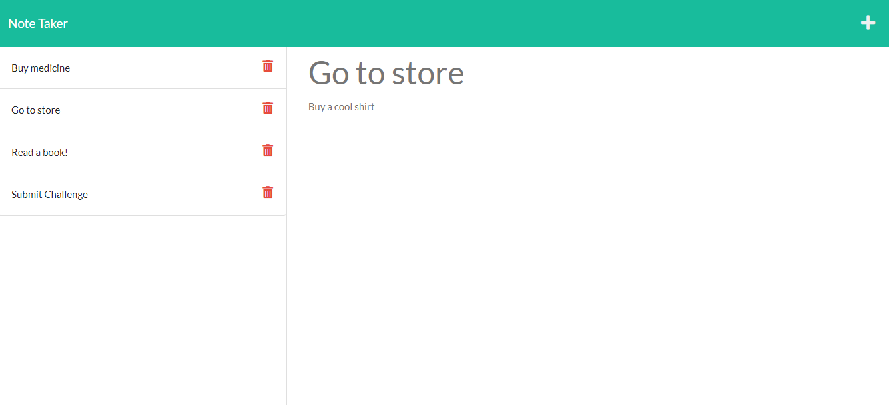

# Hermes
  

  ## Table of Contents
  -[Description](#description)
  -[Install](#install)
  -[Usage](#usage)
  -[Instructions](#instructions)
  -[Licenses](#licenses)
  -[Questions](#questions)

  ### Description
  ```
  AS A small business owner
I WANT to be able to write and save notes
SO THAT I can organize my thoughts and keep track of tasks I need to complete
  ```

  ### Install
  Download from my repo, install express, and run npm start.
 The following is a screenshot of the application 

  ### Usage
  This application runs on server port 3001, after you install and run npm start be sure to navigate to your local host 3001 port so that you can view and run the application. 

  ### Instructions
  ```
WHEN I open the Note Taker
THEN I am presented with a landing page with a link to a notes page
WHEN I click on the link to the notes page
THEN I am presented with a page with existing notes listed in the left-hand column, plus empty fields to enter a new note title and the note’s text in the right-hand column
WHEN I enter a new note title and the note’s text
THEN a Save icon appears in the navigation at the top of the page
WHEN I click on the Save icon
THEN the new note I have entered is saved and appears in the left-hand column with the other existing notes
WHEN I click on an existing note in the list in the left-hand column
THEN that note appears in the right-hand column
WHEN I click on the Write icon in the navigation at the top of the page
THEN I am presented with empty fields to enter a new note title and the note’s text in the right-hand column
  ```
  
  ### Licenses 
  None

  ### Questions
  Feel free to contact me at:
  GitHub: https://github.com/SipG789/hermes

